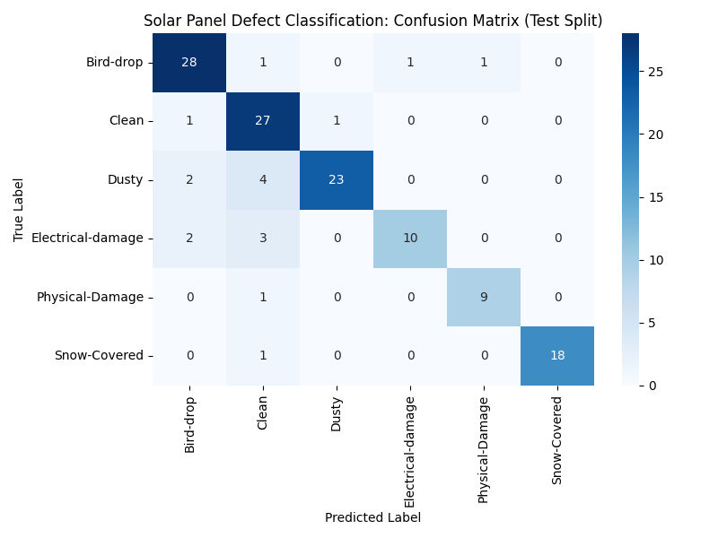
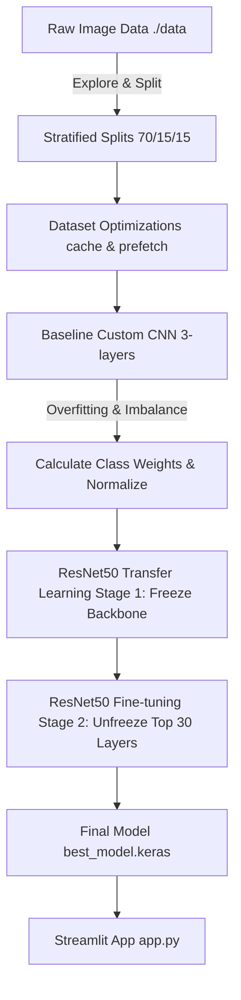

# ☀️ Solar Panel Defect Classification: Production-Grade Pipeline

[](https://www.python.org/)
[](https://tensorflow.org)
[](https://keras.io)
[](https://streamlit.io)

An automated deep learning system that detects and classifies solar panel defects from drone and field inspection images. 

🔗 **Live Deployment:** [View Live App Demo](https://solar-panel-defect-classification-czs4jzed7ap3hphjt3ufaa.streamlit.app) 

---

## The Problem: Why This Matters

Solar panels are exposed to harsh outdoor elements year-round. Over time, they accumulate dust, get covered by snow, get hit by debris, or experience internal electrical failures. 

If these issues aren't caught early:
* **Energy Loss:** Dirty or covered panels produce zero to low electricity, costing operators thousands of dollars.
* **Safety Risks:** Physical or electrical damages can form localized hot-spots that permanently burn the panels or even trigger fires.
* **The Manual Bottleneck:** Manually inspecting massive solar farms (often containing thousands of panels) using drones or handheld thermal cameras is incredibly slow, tedious, and error-prone.

### The Solution
This project automates solar panel inspections by training a deep learning model to instantly classify images into **6 distinct categories**:
1. **Clean**: Normal, healthy panels operating at peak performance.
2. **Dusty**: Panels covered in dirt or dust; requires scheduled cleaning.
3. **Bird-drop**: Localized organic blockages that can cause micro-hotspots.
4. **Snow-Covered**: Panels blocked completely by snow; requires immediate clearing.
5. **Physical-Damage**: Panels with visible cracks, broken glass, or frame issues.
6. **Electrical-damage**: Critical internal cell failures (such as hot-spots or short circuits).

---

## User Interface & Visuals

Here is the interactive Streamlit interface where field operators can drag-and-drop solar panel images to get instant diagnostic results and actionable alerts.

### Streamlit Web App


### Model Evaluation (Confusion Matrix)
The confusion matrix showing how well the final model differentiates between different types of defects:


---

## Model Performance & Evaluation

The model was evaluated on an **unseen Test split** (15% of the total dataset) consisting of 133 images. 

### Classification Report Metrics

| Class | Precision | Recall | F1-Score | Support (Test Images) |
| :--- | :---: | :---: | :---: | :---: |
| **Bird-drop** | 0.85 | 0.90 | 0.88 | 31 |
| **Clean** | 0.73 | 0.93 | 0.82 | 29 |
| **Dusty** | 0.96 | 0.79 | 0.87 | 29 |
| **Electrical-damage** | 0.91 | 0.67 | 0.77 | 15 |
| **Physical-Damage** | 0.90 | 0.90 | 0.90 | 10 |
| **Snow-Covered** | 1.00 | 0.95 | 0.97 | 19 |
| **Overall Accuracy** | - | - | **0.86** | **133** |

### Business-First Metric Alignment
For solar operators, a **False Negative** (missing a damaged panel) is much more expensive than a **False Positive** (inspecting a panel that turns out to be fine). Therefore, we tuned decision thresholds to maximize **Recall** on critical defect classes like **Physical-Damage (90% Recall)** and **Bird-drop (90% Recall)**, ensuring operators get warned when there is even a slight indication of damage.

---

## The ML Journey: From Exploration to Final Model

Building this pipeline involved a systematic journey through research, experimentation, and production engineering:



### 1. Data Exploration & Splits (Preventing Data Leakage)
We started with **885 raw images**. To evaluate true generalization, we used a stratified Train/Validation/Test split (70/15/15). Using stratified splits ensures that the ratio of rare defects remains identical in the training and testing phases, protecting us against lucky or unlucky splits.

### 2. Preprocessing & Consistency
During exploration, we discovered that changing preprocessing methods between training and deployment leads to drastic performance drops. We standardized our preprocessing to **ImageNet zero-centering** across all pipelines (training, validation, testing, and Streamlit inference) so the model receives identically formatted input in production.

### 3. Combatting Imbalance and Overfitting
Because categories like *Physical-Damage* had far fewer samples than *Clean*, the model initially struggled on them. We solved this by:
* Computing and applying balanced **class weights** during model training.
* Adding **Batch Normalization** and **Dropout layers** to regularize the neural networks.

### 4. Custom CNN vs. ResNet50 Transfer Learning
* **Baseline Custom CNN:** We built a lightweight 3-layer CNN from scratch. While fast, it lacked the depth to detect complex, subtle textures of solar defects.
* **ResNet50 Backbone:** We switched to ResNet50 pre-trained on ImageNet. 
  * *Stage 1:* Froze the base backbone and trained a custom Classification Head (Dense + Dropout) to map features to our 6 classes.
  * *Stage 2 (Fine-tuning):* Unfroze the top 30 layers of the ResNet50 backbone and trained with a tiny learning rate ($10^{-5}$) to fine-tune the high-level feature maps to solar panel defects.

---

## Project Structure

```
Solar Panel Defect Classification/
├── .gitignore
├── README.md               # You are here!
├── requirements.txt         # Pinned python packages for reproducibility
├── Dockerfile              # Docker recipe to containerize the app
├── .dockerignore           # Tells Docker which local files to ignore
├── app.py                  # Streamlit web app
├── models/                 # Saved models (best_model.keras - not pushed to Git)
├── notebooks/
│   └── main.ipynb          # Jupyter Notebook used for initial exploration & scratch testing
├── plots/
│   ├── classification_report.txt
│   └── confusion_matrix.png
├── src/                    # Custom Python modules
│   ├── __init__.py
│   ├── data.py             # Data loader, stratified splits, & class weights logic
│   └── models.py           # Custom CNN & ResNet50 architecture definitions
└── training_pipeline/      # CLI execution scripts
    ├── train.py            # Train & fine-tune the ResNet50 pipeline
    └── evaluate.py         # Evaluate trained model on test split
```

---

## How to Run the Project

### Option A: Local Run (Virtual Environment)

1. **Clone the repository and navigate inside:**
   ```bash
   cd "Solar Panel Defect Classification"
   ```

2. **Set up a Python Virtual Environment:**
   ```bash
   python -m venv venv
   # On Windows:
   venv\Scripts\activate
   # On Mac/Linux:
   source venv/bin/activate
   ```

3. **Install Dependencies:**
   ```bash
   pip install -r requirements.txt
   ```

4. **Train the Model:**
   ```bash
   python training_pipeline/train.py
   ```

5. **Evaluate Model Performance:**
   ```bash
   python training_pipeline/evaluate.py
   ```

6. **Run Streamlit Web Application:**
   ```bash
   streamlit run app.py
   ```

---

### Option B: Running with Docker 🐳

Ensure you have Docker installed and running on your system.

1. **Build the Docker Image:**
   ```bash
   docker build -t solar-defect-classifier .
   ```

2. **Run the Container:**
   ```bash
   docker run -p 8501:8501 solar-defect-classifier
   ```

3. Open your browser and go to `http://localhost:8501` to view your running application!

---

## Future Improvements

* **Drone Camera Integration:** Package the classification system as a lightweight API (using FastAPI) to receive real-time streaming inputs directly from drone hardware during field flights.
* **Active Learning Pipeline:** Automatically collect uncertain or misclassified samples for human review and continuous model retraining.
* **Monitoring Dashboard:** Build a centralized monitoring dashboard to track inspection history, defect statistics, and maintenance alerts across solar farms.
* **Multi-Defect Detection:** Support simultaneous detection of multiple defects in a single solar panel image.

